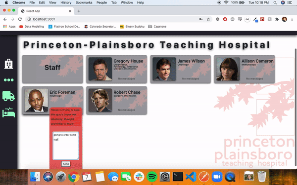

# Emergent-Need

A hospital administration app that includes built-in staff communication as well as an emergency medical supply ordering client.

Inspired by my experience working in administration at a heart clinic, I started this app due to frustrations with working on ancient, confusing, and bug-ridden medical programs such as Vision and eClinical.

## Technologies Used

Frontend: React, Javascript, Bootstrap; open-source map software Mapbox

Backend: Ruby on Rails

## Features

Full authorization with private routes - only a hospital administrator with a secure password can access the pages.

Quick and easy communication with staff members. Emails can be sent and replied to without a seperate client or navigating to another page.

Based on a medical emergency, administrator can contact nearby medical supply distribution centers to have equipment and medicine expedited to the hospital.

## Challenges

My first attempt at full authorization, and thankfully it turned out fine, though not without hitches. The backend work for it was pretty daunting, as well as working through private routes in the React frontend.

I went through CSS hell with this app and CSS combined with React to create the static nav and sidebars in the app was very time-consuming. As I work through React and get better at it, I hope to rely less and less on secondary .css files.

## Future Modifications

Include a live traffic API that provides the hospital administration a proper ETA of equipment arrival based on real-time changes on the roads. 

Include the openFDA API that allows queries to find every piece of medical equipment and medicine available in the United States - use this further bolster the equipment-ordering portion of the App.

Include other staff members in communication (not just doctors), such as nurses, custodians, administrators, etc.
